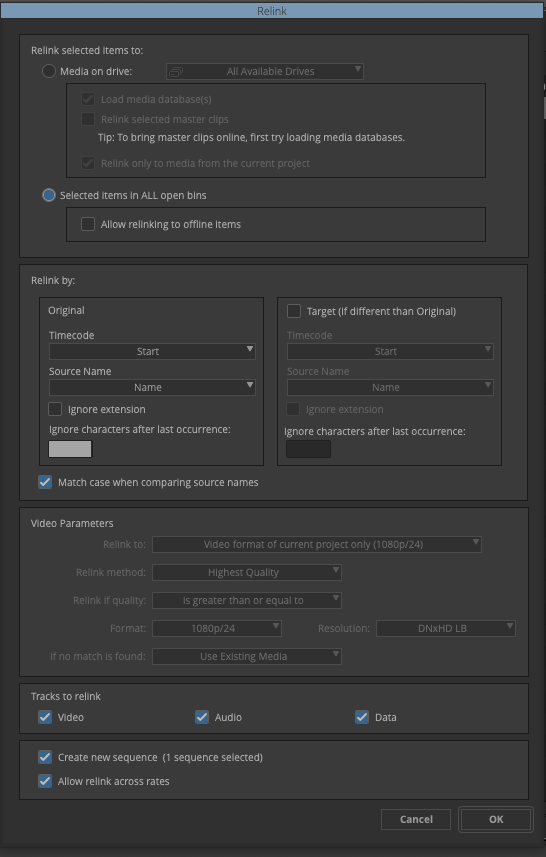

# VFX Turnover Tool v0.1

A web-based tool that streamlines VFX sequence preparation for post-production. It processes EDL files and generates multiple output formats for VFX production workflows.

## Features

- **Automatic VFX ID Generation** - Creates VFX IDs based on scene numbers (format: `FILM_ID_SCENE_SHOT`)
- **Support for Existing Markers** - Recognizes LOC lines in EDL files
- **Multiple Export Formats** - Markers, Subcaps, ALE, EDL, and spreadsheet formats
- **Timecode Calculations** - Customizable FPS and handles
- **Drag-and-Drop Interface** - Easy file upload
- **Persistent Settings** - Configuration saved locally in browser
- **Incoming VFX EDL** - Match VFX vendor clips to original EDL by source timecodes

## Workflow Guide

### 1. Create EDL from Avid

Create an EDL (File_129 or CMX3600) from the Avid video track containing only shots planned for VFX. In List Options in Avid, check: **Clip Names**, **Source File Name**, and **Markers**.

VFX IDs are created automatically based on the following rule: `FILE_ID_Scene_num`, where num is a progressive number like 010, 020, 030, etc.

Existing markers on timeline are imported into the tool as existing VFX IDs (you can find them in the EDL as `*LOC/*` LOC lines). Therefore, if you add VFX shots in Avid, you need to add markers with their new corresponding VFX IDs to re-import them correctly into the tool.

### 2. Export Markers and Subcaps

Export markers and subcaps and import them into Avid to help keep track of VFXs.

### 3. Export Frames

Export markers from Avid as JPGs to use them to build a VFX Shots database.

### 4. Export TAB Text Files

Export TAB text files with VFX IDs info, that can be imported in any database/spreadsheet to build a VFX shot database.

### 5. Export ALE Pulls

Export ALE Pulls to create pulls (subclips with VFX IDs as names from the master clips). After selecting master clips in bin, drag ALE file on bin. Import settings: *Merge events with known sources and automatically create subclips*

### 6. Export Pulls EDL

Export Pulls EDL to create a timeline with the pull subclips. Import the EDL into Avid bin, relink to the pull subclips using Names.

### 7. VFX Cut-ins

When you receive incoming VFX (.mov files), you can import them into Avid, export the bin in TAB format to create an EDL for cutting in the VFX into the timeline. Columns: **Color**, **Name**, **Duration**, **Start**, **End**, **Tape**.

## Settings

| Setting | Description | Default |
|---------|-------------|---------|
| Film ID | Project identifier used in VFX IDs | FILM_ID |
| FPS | Frame rate for timecode calculations | 24 |
| Handles | Extra frames added to pulls | 10 |

## Export Options

| Export | Description |
|--------|-------------|
| **Markers** | AVID timeline markers (configurable user, track V1-V8, and color) |
| **Subcaps** | Subtitle format for burn-ins |
| **ALE Pulls** | Avid Log Exchange file with handles for creating pulls |
| **Pulls EDL** | EDL for cutting in VFX pulls |
| **Google Tab** | Tab-delimited file for spreadsheet import |

## Supported File Formats

| Type | Extensions |
|------|------------|
| EDL Input | `.edl` (File_129, CMX3600) |
| AVID Bin | `.txt` |

## Technology

Single-page web application built with:
- React 18
- Tailwind CSS
- No server required - runs entirely in the browser

## Installation

No installation required. Simply open `index.html` in a web browser.

Alternatively, host on any static web server.

## Contact

For questions or feedback: [pnardese@gmail.com](mailto:pnardese@gmail.com)

## License

MIT License
