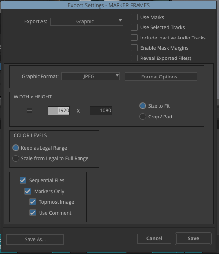
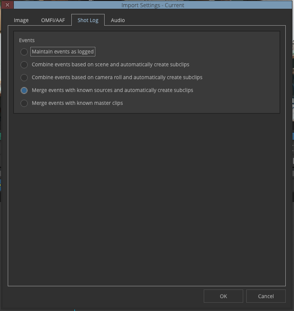
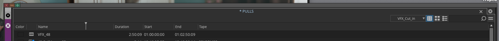

# VFX Turnover Tool v0.2

[](LICENSE.md)

A web-based tool that streamlines VFX sequence preparation for post-production workflows in Avid Media Composer. It processes EDL files and generates multiple output formats for VFX production workflows.

## Features

- **Automatic VFX ID Generation** - Creates VFX IDs based on scene numbers (format: `FILM_ID_SCENE_SHOT`) only when the EDL has no existing markers; if any markers are present, IDs are read directly from the markers and missing ones are flagged as warnings
- **Support for Existing Markers** - Recognizes LOC lines in EDL files; marker IDs are never overwritten
- **Multiple Export Formats** - Markers, Subcaps, ALE, EDL, and spreadsheet formats
- **Timecode Calculations** - Customizable FPS and handles
- **Drag-and-Drop Interface** - Easy file upload
- **Persistent Settings** - Configuration saved locally in browser
- **Persistent File Data** - Loaded EDL and AVID Bin files are preserved across browser sessions
- **Clear Data Controls** - Easily clear loaded files with one-click buttons
- **Change Tracking** - Compare new EDL with cached version: new clips in green (NEW - NEED TO PULL), removed in red, trimmed clips flagged as TRIMMED BUT NO NEED TO PULL (yellow) or TRIMMED - NEED TO PULL (orange), clips missing a VFX ID in purple, marker ID changed between versions in amber (CHECK IN AVID), reel mismatches shown with a warning banner; preview table sorted by EDL event order
- **Changelist Export** - Export the full changelist as a tab-delimited file for import into spreadsheets or databases
- **Incoming VFX EDL** - Match VFX vendor clips to original EDL by source timecodes

## Workflow Guide

### 1. Create EDL from Avid

Create an EDL (File_129 or CMX3600) from the Avid video track containing only shots planned for VFX. In List Options in Avid, check: **Clip Names**, **Source File Name**, and **Markers**.

VFX IDs are created automatically based on the following rule: `FILM_ID_Scene_num`, where num is a progressive number like 010, 020, 030, etc.

#### How scene numbers are extracted

The EDL contains a comment line for each event with the subclip name, for example:

```
*FROM CLIP NAME:  33-4-/01
```

The tool reads the **first sequence of digits** in the clip name as the scene number — in this example `33`, padded to three digits: `033`. The shot counter within that scene starts at `010` and increments by 10 for each additional clip in the same scene, giving IDs such as `FILM_ID_033_010`, `FILM_ID_033_020`, etc.

> This convention assumes a standard feature-film workflow where subclips are named with scene number followed by take information (e.g. `33-4-/01` = scene 33, shot 4, take 1). If your project uses a different naming convention, assign VFX IDs manually in Avid Media Composer via markers before exporting the EDL.

When the EDL has no LOC markers at all, VFX IDs are auto-generated for every clip. When the EDL contains any LOC markers (a marked EDL), the tool reads VFX IDs directly from those markers and never overwrites them. Clips without a marker in a marked EDL are flagged with a **MISSING VFX ID** warning — assign the marker in Avid and re-export the EDL.

Therefore, if you add VFX shots in Avid, you need to add markers with their new corresponding VFX IDs before exporting the EDL so they are imported correctly into the tool.


Once exported, load the `.edl` file into the tool by **dragging and dropping it** onto the drop zone in the main window, or clicking the drop zone to **browse your local disk**.

### 2. Export Markers and Subcaps

Export markers and subcaps and import them into Avid to help keep track of VFXs.

### 3. Export Frames

Export markers from Avid as JPGs to use them to build a VFX Shots database.



If you use **Google Sheets** to manage your VFX database, you can automatically import the exported frame images into your sheet using [insertShotImages](https://github.com/pnardese/insertShotImages) — a companion script that reads the exported JPGs and inserts them into the corresponding rows of your Google Sheet.

### 4. Export TAB Text Files

Export TAB text files with VFX IDs info, that can be imported in any database/spreadsheet to build a VFX shot database.

The exported file contains one row per shot with the following columns:

| Column | Description |
|--------|-------------|
| `#` | Shot counter |
| `Name` | VFX ID |
| `Thumbnail` | *(empty — for thumbnail reference)* |
| `Comments` | *(empty)* |
| `Status` | *(empty)* |
| `Date` | *(empty)* |
| `Duration` | Source clip duration as timecode |
| `Start` | Source start timecode |
| `End` | Source end timecode |
| `Frame Count Duration` | Duration in frames |
| `Pull Handles` | Handle frames configured for the project |
| `Tape` | Source reel / tape name |

### 5. Export ALE Pulls

Export ALE Pulls to create pulls (subclips with VFX IDs as names from the master clips). After selecting master clips in bin, drag ALE file on bin. Import settings: *Merge events with known sources and automatically create subclips*



### 6. Export Pulls EDL

Export Pulls EDL to create a timeline with the pull subclips. Import the EDL into Avid bin, relink to the pull subclips using Names.


### 7. VFX Cut-ins

When you receive incoming VFX (.mov files), you can import them into Avid, export the bin in TAB format to create an EDL for cutting in the VFX into the timeline. Columns: **Color**, **Name**, **Duration**, **Start**, **End**, **Tape**.



Relink imported EDL to mov files like in Pulls EDL.

## Settings

| Setting | Description | Default |
|---------|-------------|---------|
| Film ID | Project identifier used in VFX IDs | FILM_ID |
| FPS | Frame rate for timecode calculations — dropdown: 23.976, 24, 25, 29.97 | 24 |
| Resolution | Video format written to ALE `VIDEO_FORMAT` header | 1080 |
| Pull Handles | Extra frames added to pulls | 10 |

## Data Persistence

All settings and loaded file data are automatically saved to your browser's local storage:

- **Settings** - Film ID, FPS, Resolution, Pull Handles, Marker User, Position, Track, and Color
- **Loaded Files** - EDL and AVID Bin file data persist across browser sessions
- **File Names** - The names of loaded files are displayed in the upload zones and preview sections

Use the clear buttons (X) next to the upload zones to remove loaded file data.

## Change Tracking

When loading a new EDL file, the tool compares it with the previously cached version:

- **Grey (unchanged)** - VFX IDs present in both versions with identical source timecodes
- **Green — "NEW - NEED TO PULL"** - VFX IDs added in the new EDL; a pull is always required
- **Red with strikethrough (removed)** - VFX IDs no longer present in the new EDL
- **Yellow — "TRIMMED BUT NO NEED TO PULL"** - Source timecodes changed, but the new in/out points fall within the existing pull range (`old Source In − handles` → `old Source Out + handles`); no new pull required. Changed timecodes are highlighted in yellow.
- **Orange — "TRIMMED - NEED TO PULL"** - Source timecodes changed and the new in/out points fall outside the existing pull range; a new pull is required. Changed timecodes are highlighted in orange.
- **Purple — "MISSING VFX ID"** - Clip has no LOC marker (no VFX ID assigned) in a marked EDL. If the clip can be matched to a cached event by reel and source timecode, the previous VFX ID is shown as `(was: PREV_ID)`.
- **Amber — "MARKER ID CHANGED — CHECK IN AVID"** - A clip matched by reel and source timecode has a different VFX ID in the new EDL's marker compared to the cached version. This indicates the marker was edited in Avid; verify the change is intentional before proceeding.

Warning banners are shown when:
- Any clip has a **reel mismatch** — the source reel changed between versions (affected VFX IDs listed; rows highlighted in red).
- Any clip is **missing a VFX ID** — listed in EDL event order with event number and reel.
- Any clip has a **marker ID changed** — listed with new and previous VFX IDs.

Preview table rows are sorted by EDL event order. Removed events appear at the end of the table.

Removed VFX IDs are shown for reference but are excluded from all exports.

The **Export Changelist** button (top-right of the Preview panel) downloads a tab-delimited `.txt` file with one row per event and a `Status` column populated with `NEW`, `REMOVED`, `CHANGED - NO PULL NEEDED`, or `NEED PULL`. The file uses the same column structure as the DB Export and can be imported directly into any spreadsheet or database.

## Export Options

| Export | Description |
|--------|-------------|
| **Markers** | AVID timeline markers (configurable user, position start/middle, track V1-V8, and color) |
| **Subcaps** | Subtitle format for burn-ins |
| **ALE Pulls** | Avid Log Exchange file with handles for creating pulls |
| **Pulls EDL** | EDL for cutting in VFX pulls |
| **DB Export** | Tab-delimited file for spreadsheet / database import |
| **Export Changelist** | Tab-delimited changelist with Status column; includes all events (new, removed, trimmed, unchanged) |

## Supported File Formats

| Type | Extensions |
|------|------------|
| EDL Input | `.edl` (File_129, CMX3600) |
| AVID Bin | `.txt` |

## Technology

Single-page web application built with:
- React 18
- Tailwind CSS
- No server required - runs entirely in the browser

## Installation

### Option 1: Online

Access the tool directly at: [https://pnardese.github.io/web-vfx-turnover/](https://pnardese.github.io/web-vfx-turnover/)

### Option 2: Local HTTP Server

1. Clone the repository:
   ```bash
   git clone https://github.com/pnardese/web-vfx-turnover.git
   cd web-vfx-turnover
   ```

2. Run the launch script (starts a Python HTTP server on port 8080 and opens the browser automatically):
   ```bash
   ./launch.sh
   ```

   Or start the server manually:
   ```bash
   python3 -m http.server 8080
   ```

3. Open your browser and navigate to:
   ```
   http://localhost:8080
   ```

### Option 3: Static Web Server

Host the files on any static web server (Apache, Nginx, etc.).

## Contact

For questions or feedback: [pnardese@gmail.com](mailto:pnardese@gmail.com)

## License

MIT License
